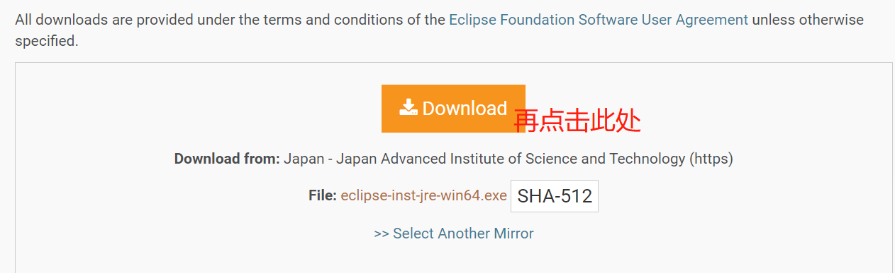
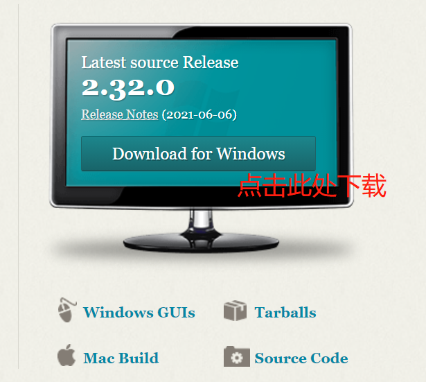

# 环境安装

## 1. JDK安装

(1) 在[Java Archive Downloads - Java SE 16](https://www.oracle.com/java/technologies/javase/jdk16-archive-downloads.html) 中下载jdk


(2) 双击exe文件执行安装


(3) 新建系统环境变量


点击新建环境变量，添加系统环境变量 JAVA_HOME 以及 classpath


选择已有的系统环境变量Path并点击编辑->新建


(4) 验证结果，按win+r键输入cmd


在cmd中输入如下命令

```cmd
java -version
```


## 2. IDE安装

(1) 在[*Eclipse* Downloads | The *Eclipse* Foundation](https://www.baidu.com/link?url=jVS_yXioMjvcXNG0znP04dPZkldIHQQQI2EdhcylcPOQcHt0FhACOaQaLhtj1qaf&wd=&eqid=99755b3900000966000000036110aeca) 中下载eclipse




(2) 运行exe文件


根据提示进行安装


## 3.安装git

(1) 前往[git](https://git-scm.com/) 下载



(2) 运行exe程序


## 4.上传至github

(1) 到[github](https://github.com/) 并登陆账号，点击左上角头像并选择仓库

 

(2) 点击new创建新仓库


(3) 打开git cmd

定位到readme.md所在文件夹，并进行初始化

```
cd C:\Users\11548\training\environment
git init
```


(4) 打开.git并编辑config文件

加入邮箱和姓名


(5)在git cmd中同步到仓库中


 

